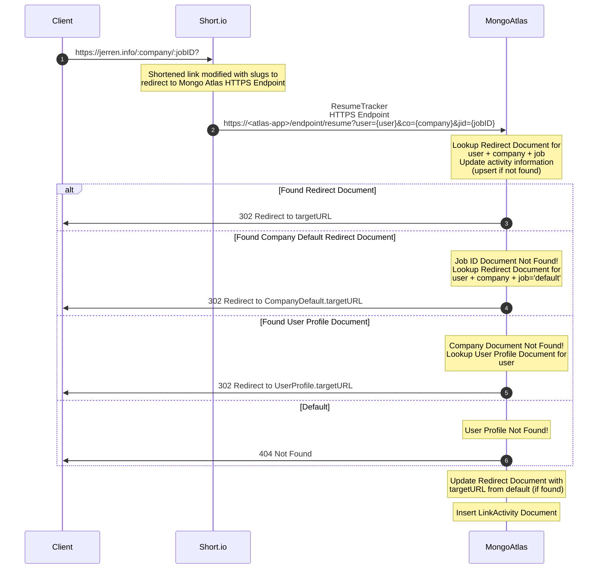

<!-- markdownlint-disable MD033 -->
# ResumeTracker

Mongo Atlas App Service to handle tracking unique codes for insight on viewing of resumes

## Background

After unexpectedly being thrown back in the job market, I recognized the need for a dynamic platform to showcase my technical abilities and problem-solving approach in a way that transcends a static resume. Since code from my previous company was confidential (and no longer accessible), this project provided the perfect solution to not only add to my [portfolio](https://github.com/jerrens/Portfolio), but also to help with my job searching journey.

This web application allows me to demonstrate my technical capabilities in several ways. First, it features a personal code sample, giving potential employers a deeper understanding of my thought process and coding style.  Second, it highlights my creativity, adaptability, and capability of tackle new challenges by showcasing my proficiency with Mongo Atlas, a popular cloud-based database platform.  Also, while most of my Mongo experience has centered around managing and interacting with on-premise MongoDB ReplicaSet servers, the cloud-based platform provides a serverless solution so I can focus on functionality instead of the overhead and cost that are not needed for this situation.

The intended usage is to allow me to include a custom link on my resume and applications, which will allow me to direct potential employers to a personalized landing page which serves as an electronic portfolio.  This portfolio will provide them the opportunity to explore not just my resume but also view past performance reviews, relevant code samples, and any other materials that I can continually add, even after the initial resume has been submitted.

Perhaps most importantly, this project allows me to gather valuable feedback and insight not normally attainable by applicants. Submitting resumes often appear as a black hole for applicants with no knowledge if their resume piqued any interesting of those viewing it (or was even viewed at all). By tracking visits to the custom link, I can track whether potential employers are engaging with my professional portfolio. The beauty of this approach lies in its flexibility. The landing page can be continuously updated with fresh content, even after submitting my resume for a specific position, allowing me to maintain a dynamic and evolving professional presence. It also enables the potential for A/B testing to determine which resumes are effective enough to elicit additional interest in my abilities.  I am confident that by providing this professional portfolio positions me to make a strong first impression on prospective employers.

## Overview

The following sequence diagram describes how this Resume Tracker service works.

## Additional Details

Additional documentation including collections, configuration, and [schema](./documentation/schema/) may be found in the [/documentation](./documentation/) folder.

### Core Logic

The primary logic that handles the redirect lookup can be found in [/functions/HTTPSEndpoints/GetResume.js](./functions/HTTPSEndpoints/GetResume.js).

### Aggregates

Initially, aggregates will be used to analyze the contents of the database using Studio 3T.  These aggregates can be found in [/reports/aggregates](./reports/aggregates/).
Over time, I hope to expand this interface by creating a simple HTML page to retrieve data and visualize the data.

## Components Used

1. Purchased a custom domain from [NameCheap.com](https://NameCheap.com)
    - This low-cost solution will present a professional view vs a random alpha numeric slug
    - Configured this domain to redirect to my short.io account as instructed

1. Used a [Short.io](https://Short.io) Free account to create and manage short links that redirect to the appropriate MongoAtlas HTTPS Endpoint
    - This allows short, user friendly URLs (or QR codes) to be referenced on a resume, but converted into the correct query parameters to better tracking

1. Created [Mongo Atlas](https://www.mongodb.com/atlas) App Service for ResumeTracker
    - Configured to link with this GitHub repo

## ToDo

- [ ] Convert LinkActivity to Time Series Collection
  - Will need to define a meta field for the document
  - Can also define a (long) TTL to avoid the collection growing over time
  - See <https://www.mongodb.com/docs/v7.0/core/timeseries/timeseries-migrate-data-into-timeseries-collection/>
- [ ] Review Indexes
- [ ] Refactor [/functions/HTTPSEndpoints/GetResume.js](./functions/HTTPSEndpoints/GetResume.js) function.
- [ ] Create Tests - <https://www.mongodb.com/docs/atlas/app-services/functions/test/>
- [ ] Explore Mongo Atlas Charts to view link activity
- [ ] Alternative: Build Simple static UI page to view link activity
  - Use [GitHub Pages](https://pages.github.com/)
  - Add endpoint to Mongo App Service to retrieve the link activity (query params for user)
  <!-- - See <https://medium.com/flycode/how-to-deploy-a-static-website-for-free-using-github-pages-8eddc194853b> for guide -->
- [ ] Add ES Lint configuration to project
- [ ] Add a trigger to send a notification when a new document is inserted
